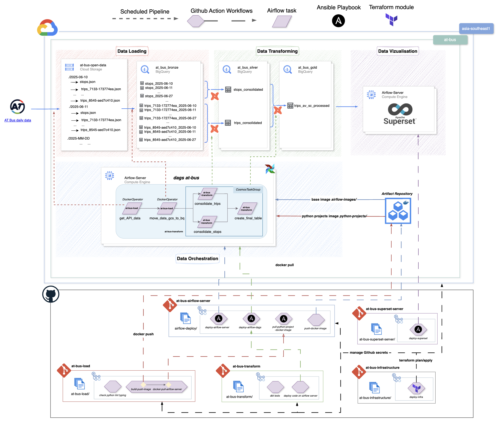

# At Bus transform

This repository is a part of AT Bus project. This project aims to build an ELT pipeline from open source data to a dashboard in order to visualise what are the best route bus from Avondale to Sagrado Cantina, a Mexican Restaurant in K Road, Auckland, New Zealand. The open data is provided by Auckland Transport [here](https://dev-portal.at.govt.nz/api-details#api=gtfs-api&operation=get-calendars-id).

All of the repositories of this project are the follow ones:

- [at-bus-load](https://github.com/Philippe-Neveux/at-bus-load): Python repository for loading data from the open API provided by Auckland Transport to a Google Cloud Storage bucket and then moved to BigQuery.
- [at-bus-transform](https://github.com/Philippe-Neveux/at-bus-transform): dbt project for transforming the data from BigQuery bronze dataset to a BigQuery gold dataset.
- [at-bus-superset-server](https://github.com/Philippe-Neveux/at-bus-superset-server): Superset server for visualising the BigQuery gold dataset (Ansible).
- [at-bus-airflow-server](https://github.com/Philippe-Neveux/at-bus-airflow-server): Airflow server for orchestrating the ELT pipeline (Ansible).
- [at-bus-infrastructure](https://github.com/Philippe-Neveux/at-bus-infrastructure): Infrastructure repository for managing the infrastructure of the project (Terraform).



---
This dbt project transforms Auckland Transport (AT) bus data into a structured format for analysis. It fetches raw data from AT's public API, processes it through staging and intermediate models, and produces a final gold dataset.

## Project Structure

- **models/**: Contains the dbt models, organized into:
  - `silver/`: Intermediate transformations that clean and structure the raw data.
  - `gold/`: Final, analytics-ready models.
- **macros/**: Contains custom Jinja macros.
- **analyses/**: Contains ad-hoc analyses.
- **seeds/**: Contains seed data for the project.
- **snapshots/**: Contains model snapshots for tracking changes over time.
- **dbt_project.yml**: The main dbt project configuration file.
- **profiles.yml**: Configures connection settings for dbt to connect to BigQuery.
- **pyproject.toml**: Python project configuration for tools like `uv`.
- **Makefile**: Contains convenient commands for common tasks.

## Setup

1. **Install Dependencies**
   Install the required Python packages using `uv`:
   ```sh
   uv sync
   ```

2. **Set Up Environment Variables**
   This project uses BigQuery for its data warehouse. You need to configure your GCP credentials as environment variables. Create a `.env` file in the root of the project and add the following:
   ```
   GCP_PROJECT_ID="your-gcp-project-id"
   GCP_DATASET_BIGQUERY="your-bigquery-dataset"
   ```
   The dbt profile is configured to read these variables for the connection.

3. **Authenticate with GCP**
   Make sure you have the `gcloud` CLI installed and authenticated:
   ```sh
   gcloud auth application-default login
   ```

## Usage

This project includes a `Makefile` to simplify common commands.

- **Run all dbt models:**
  ```sh
  make dbt_run
  ```

- **Test all dbt models:**
  ```sh
  make dbt_test
  ```

- **Generate and view dbt documentation:**
  ```sh
  make dbt_docs
  ```

- **Run specific models:**
  The `Makefile` also includes targets for running specific sets of models:
  ```sh
  make dbt_run_stops_consolidated
  make dbt_run_trips_consolidated
  make dbt_run_gold_dataset
  ```
